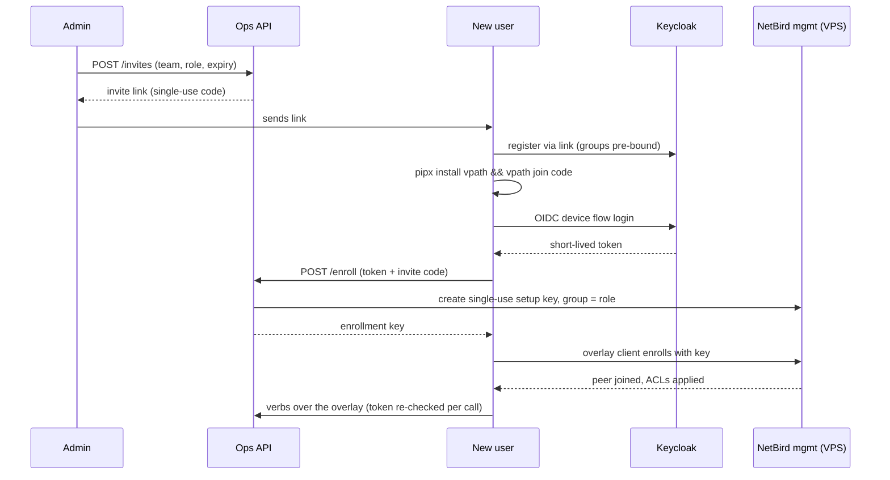

# How the Access Mechanism Works

> **Status: design specification.** Internals behind `USER_ACCESS.md`, per
> decisions 4, 6, 12, 15 and the MVP sketch (M0/M3). For the user-facing
> view, read that doc; this one explains what actually happens and why it is
> safe.

## Two layers, never conflated

- **Reachability** — who can open a TCP connection to which port. Solved by
  a WireGuard mesh overlay (NetBird, self-hosted). The overlay is a
  *doorbell*: it gets you to the door, nothing more.
- **Authorization** — who may execute which verb on which app. Solved by
  Keycloak OIDC + Ops API RBAC + locks. Network access **never** implies ops
  rights; every verb is re-checked at the API regardless of where the call
  comes from.

One identity authority: the existing VPath Keycloak realm. The overlay, the
CLI, the console, and the Ops API all authenticate against it. There is no
second user database anywhere in the mechanism.

## Components and what each one holds

| Component | Where it runs | Holds | Never holds |
|---|---|---|---|
| Keycloak realm | Shared server (existing) | Accounts, groups (team + role), OIDC clients | Network keys |
| NetBird management | vm5-class VPS | Peer registry, ACL policy, setup keys; delegates login to Keycloak (OIDC) | Passwords; app data; ops rights |
| NetBird client | Every device + the NUC | Device WireGuard keypair | User credentials |
| Ops API | NUC | RBAC map, job queue, invites, audit; a service account for cluster writes | User passwords; long-lived user tokens |
| CLI / console | User side | Short-lived OIDC tokens | Admin kubeconfigs, SSH keys |

The NUC is **never publicly exposed** — no port forwarding, no public
ingress. The in-cluster registry is reachable only through the overlay.
The airgapped claas-remote target is entirely outside this mechanism
(Admin-side runbook instead; decisions 8, 10).

## The onboarding sequence

Properties of each artifact in that flow:

- **Invite code** — single-use, expiring, bound to team + role, minted only
  by Admins, every mint audited. Stolen before use, it grants: the ability
  to register a *visible* account in a known team — nothing else.
- **OIDC tokens** — short-lived; the CLI stores only the refresh token the
  realm policy allows; the Ops API validates the JWT (issuer, audience,
  expiry, groups claim) on **every** request.
- **Enrollment key** — single-use, role-group-scoped, short expiry, issued
  only to an authenticated caller presenting a valid invite. It can enroll
  exactly one device into exactly one ACL group, once.
- **Device keypair** — generated on the device by the overlay client; the
  private key never leaves it.

## Network policy: the ACL mirror of the role matrix

| Overlay group | May reach on the NUC | Blocked |
|---|---|---|
| `app-dev` | Ops API/console (443) · registry (`REGISTRY_PORT`) · platform HTTPS (`VPATH_PORT`) | SSH, kube API, everything else |
| `admin` | All of the above + SSH (22) | kube API from devices (only the Ops API's service account writes to the cluster) |
| `server-dev` | HTTPS surfaces only | SSH, unless a break-glass lease temporarily adds the device to an `admin`-like group with an expiry |

Default deny: a port not listed is unreachable, for everyone.

## Runtime authorization (after onboarding)

Every verb call carries the user's token. The Ops API derives
`(user, team, role)` from validated claims, checks the verb→role map and app
ownership, acquires the lock the verb's scope requires, and writes the audit
record — including refusals. Cluster writes are performed exclusively by the
API's own service account; no user token or user device ever talks to the
kube API directly (decision 6).

## Revocation — one switch, everything off

Disabling the Keycloak account is the master switch: OIDC tokens stop
refreshing (console, CLI, API die within token lifetime) and the overlay
login is refused. Peer records for disabled accounts are removed by a
reconcile loop in the Ops API (compares NetBird peers against Keycloak
accounts; interval and SCIM upgrade are an open design item — flagged, not
silently assumed). Narrower revocations: `vpath leave` (one device),
deleting a peer in NetBird (stolen laptop), letting an invite or lease
expire (they do so on their own).

## Failure modes, stated honestly

- **VPS/control-plane down:** established overlay sessions keep working
  (WireGuard data plane is peer-to-peer); new joins and ACL changes wait.
  Ops verbs are unaffected for connected users.
- **Overlay client broken on a device:** that device is offline; nothing
  else is. `vpath doctor` names the failing layer.
- **Ops API down:** no verbs for anyone — by design there is no side door;
  Admins can SSH (they are in the `admin` ACL group) to restart it.
- **Keycloak down:** existing tokens ride out their lifetime; no new logins.
  This is the platform's existing identity dependency, not a new one.
