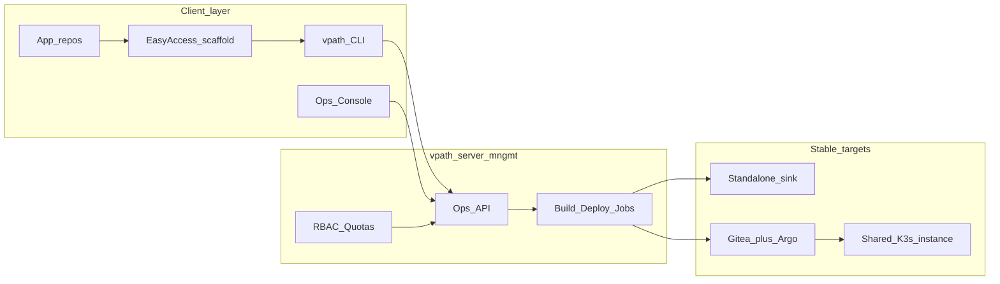
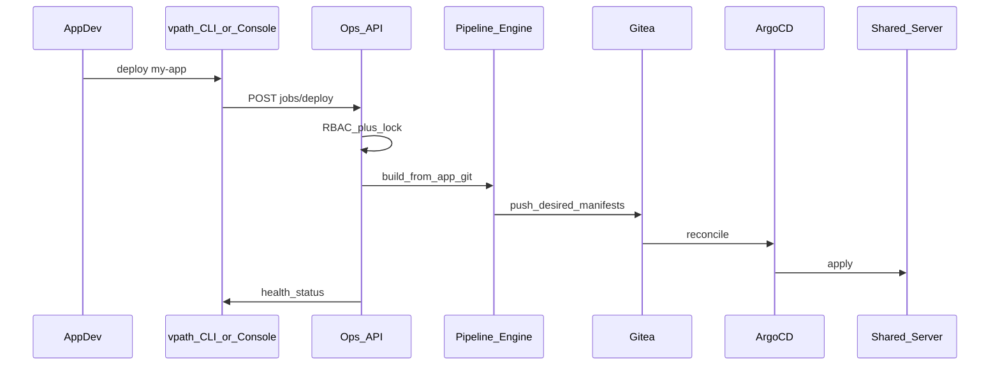

# Ops Isolation — Handoff Bundle for `vpath-server-mngmt`

Copy everything from **HANDOFF BUNDLE** through **End of handoff** into the management repo. Secrets stay out of git; only env var *names* and hostnames are listed.

---

## HANDOFF BUNDLE

### 0. Purpose

Isolate build / deploy / health / uninstall / (re)install of server instances out of the VPath **server product** monorepo so three roles can work without touching stable server/standalone/pipeline source day-to-day.

**This repo (`vpath-server-mngmt`)** = control plane: Ops API + console + thin CLI + RBAC + job queue.

**Not this repo:** a second copy of Gradle / `lib/pipeline`. Engine stays install-once on the shared server (Coolify inversion); this repo *triggers* it.

### 1. Roles

| Role | Goal | Uses `vpath-server-mngmt` for | May still use server monorepo for |
|---|---|---|---|
| App-Entwickler | Local test, then install on shared server | build/deploy/health/uninstall own apps | never (for ops) |
| Administrator | Install/maintain server instances | reinstall/erase, teams/quotas, promote | break-glass only |
| Serverprojekt-Entwickler | Hotfixes/analysis | diagnostics, logs, status | code analysis / patches |

### 2. Locked architecture decisions

| Component | Decision | Weight note |
|---|---|---|
| Topology | **Coolify inversion** — engine on shared server; clients only trigger | Do not extract full Gradle into this repo as day-to-day DX |
| Pipeline hosting | **A→B staged** — wrap today’s Gradle first; later publish versioned job image | Never git-submodule `lib/pipeline` |
| Console | **Hybrid CLI + thin GUI**; chatbot phase-2 only | Destructive ops need confirmed forms |
| Multi-user | **Teams → Projects → Environments → Jobs** + locks | Concurrent app deploys OK; reinstall exclusive |
| EasyAccess | Separate template/scaffolder → register with Ops API | Not monorepo `new-app` |
| Auth | Keycloak OIDC; short-lived tokens; no kubeconfig for App-devs | Ops RBAC ≠ app OpenFGA |
| Deploy authority | GitOps (Gitea→Argo) when live; until then temporary `redeployApp` adapter | **No fourth kubectl authority** |

### 3. Repo family

1. **`vpath_server` / `vpath_server-1`** — platform product (stable).
2. **`vpath-server-mngmt`** — this management product (daily tool).
3. **EasyAccess / app-template** — Temakollegen create apps here; point at Ops API.

### 4. Shared-server connection contract (no secrets)

Credentials live in **operator-local** env / password managers / cluster secrets — never commit passwords, API keys, or private keys into `vpath-server-mngmt`.

#### 4.1 Known install targets (pick primary for the team)

| Target id | Class | Host / reachability | SSH user (documented) | Install mode | Notes |
|---|---|---|---|---|---|
| `claas-remote` | Airgapped enterprise remote | `dehwllvpath01.claas.local` | Prefer `ADME017092` (AD prefix required on this host); docs also show `E017092` | Windows/Linux remote-deploy (`REMOTE_DEPLOY_*`) | npm/node **not** available on remote; builds elsewhere, transfer in. Source: CLAUDE.md + `doc/setup/win.md` |
| `nuc` | Shared physical NUC (team) | `192.168.178.106` (SSH alias often `cuda-nuc`) | `nuc` (also seen: `kelly` for some ops) | `VPATH_INSTALL_MODE=nuc` / `-Penv=nuc` | Build host == deploy host; workspace often `/workspace` or `/home/nuc/project/vpath_server`. Overlay: `config/dot_env/.env.nuc` in server monorepo |
| `vm5` | Azure VM class (recent) | Public IPs documented in `reports/reinstall-20260721-201733.md` (e.g. `135.116.56.132`); private `10.0.0.4` | `azureuser` | from-within / nuc-style overlay `.env.vm5` | Distinct from physical NUC; do not overwrite `.env.nuc` |
| `lima-dev` | Local Mac Lima | VM hostname e.g. `targetvm-dev` | Lima user via `limactl` | Mac two-box (build-vm + deploy-vm) | Not the multi-user shared server |

**Primary for “everyone uses one central server”:** set explicitly in `vpath-server-mngmt` config as `VPATH_MNGMT_TARGET=nuc|claas-remote|vm5|…`. Default recommendation for Temakollegen: **`nuc`** if that box is the shared team instance; use **`claas-remote`** when the CLAAS airgapped box is the agreed shared host.

#### 4.2 Env vars the management plane must understand

| Variable | Meaning | Typical values |
|---|---|---|
| `VPATH_HOST` | Public/service hostname for HTTPS URLs | host from table above |
| `VPATH_PORT` | Ingress NodePort / TLS port | `30600` (dev default); overlays may use `443` |
| `VPATH_INSTALL_MODE` / `VPATH_ENV` | Topology selector | `nuc`, `dev`, `vm5`, … |
| `NUC_HOST` / `NUC_USER` / `NUC_SSH_KEY` / `NUC_WORKSPACE` | nuc-mode SSH | host + user; key default `~/.ssh/id_ed25519`; workspace `/workspace` |
| `REMOTE_DEPLOY_HOST` / `REMOTE_DEPLOY_USER` / `REMOTE_DEPLOY_SSH_KEY` | Generic remote deploy | mirrored from NUC_* in nuc mode |
| `DEPLOY_VM_SSH_*` | Lima build-vm → deploy-vm | only lima topologies |

Source of truth for loading today: server monorepo `config/dot_env/.env` + overlay `.env.$VPATH_ENV` (gitignored locally), resolved by `lib/vm.sh`.

#### 4.3 HTTPS service URL pattern (same on every target)

Base: `https://${VPATH_HOST}:${VPATH_PORT}/`

| Service | Path |
|---|---|
| Landing | `/` |
| Keycloak | `/keycloak/` |
| Argo CD | `/argocd/` |
| Gitea | `/gitea/` |
| Argo Workflows | `/argo/` |
| Monitor | `/monitor/` |
| KP Admin | `/kp-admin/` |

OIDC discovery probe:  
`https://${VPATH_HOST}:${VPATH_PORT}/keycloak/realms/vpath/.well-known/openid-configuration`

#### 4.4 Where secrets live (do not paste into this repo)

| Secret | Location |
|---|---|
| SSH private keys | Operator `~/.ssh/` (e.g. `id_ed25519`) |
| Server monorepo `.env` / `.env.nuc` | `vpath_server` `config/dot_env/` (gitignored) |
| Keycloak admin password | K8s: `kubectl -n keycloak get secret keycloak-admin -o jsonpath='{.data.password}' \| base64 -d` |
| Demo user passwords | Pattern in docs only; create via `setupDemoUsers` / REST — never via nested `kcadm.sh` |
| Azure OpenAI / LLM keys | Operator `.env` — Azure currently firewall-blocked for some clusters; `LLM_PROVIDER=openai` may be required |

#### 4.5 kubectl on shared boxes

Prefer `sudo /usr/local/bin/k3s kubectl` when bare `kubectl` cannot read `/etc/rancher/k3s/k3s.yaml`. After provision, user kubeconfig should exist at `~/.kube/config` (chmod 600). Management plane must not distribute admin kubeconfigs to App-Entwickler.

#### 4.6 Safety rules that apply to remote ops

- No “dropper” pattern (write `/tmp/*.sh` on remote then execute) — antivirus heuristics.
- No Python/paramiko for remote SSH — bash/SSH inline only.
- No silent fallbacks; fail fast.
- Destructive ops (`eraseInstallation`, `goReinstall -Pfull`) = Admin + explicit confirmation.
- Default app fix redeploy: `./gradlew redeployApp -Papp=<name>` (~3 min), not full reinstall.

#### 4.7 Temporary engine adapter (until Ops API owns jobs)

Until `vpath-server-mngmt` has its own job runner, documented wrap targets in the **server** monorepo:

| Verb | Surface today |
|---|---|
| Build | `./gradlew buildApp -Papp=<name>` |
| Deploy/redeploy | `./gradlew redeployApp -Papp=<name>` or `bin/vpath deploy` |
| Uninstall | `bin/vpath uninstall <app>` |
| Health / status | PhaseGate + `bin/vpath status` / health-check scripts |
| Server reinstall | `./gradlew goReinstall` (`-Pfull` = eraseInstallation) |

Management MVP: authenticated job that invokes these on the chosen target — then retire direct developer access.

### 5. MVP verbs for the console/CLI

- All roles: `build`, `deploy`, `health`, `uninstall` (scoped), `status`, `logs`
- Admin: `reinstall`, `erase`, team/quota admin, promote
- Server-dev: read-only deep diagnostics; break-glass write via Admin lease

### 6. Suggested first tree in `vpath-server-mngmt`

```text
README.md                 # this handoff condensed
docs/CONNECTION.md        # §4 connection contract
docs/ARCHITECTURE.md      # Coolify inversion + no fourth authority
docs/ROLES.md             # role matrix
config/targets.example.yaml   # nuc / claas-remote / vm5 stubs (no secrets)
src/api/                  # Ops API skeleton
src/cli/                  # thin vpath client
src/web/                  # thin console
```

### 7. Open operator calls (fill before coding targets)

1. **Primary shared target id:** `nuc` | `claas-remote` | `vm5` | other: ___
2. App-devs: must build fully offline, or is “local = standalone + published images” enough?
3. Who promotes shared-dev → production channel?

---

## End of handoff

(Below: full weighted brainstorm kept for design context; optional to copy.)

---

# Ops Isolation Brainstorm — Weighted Options + Recommended Path

## Reality check (repo facts vs. stated Kontext)


| Claim in Kontext                          | Repo status today                                                                                                                                                                                                       |
| ----------------------------------------- | ----------------------------------------------------------------------------------------------------------------------------------------------------------------------------------------------------------------------- |
| GitOps aktiviert                          | **Decided** (E1–E8, 2026-07-16), **not live** — Argo installed but inert; real path is still imperative `lib/pipeline/deploy-app.sh` ([todo/gitops-deploy-of-record/demand.md](todo/gitops-deploy-of-record/demand.md)) |
| Container install/uninstall on Standalone | Designed / in progress; PIPELINE UNITY LAW forbids a second pipeline ([analysis/standalone-deployment/CONCEPT.md](analysis/standalone-deployment/CONCEPT.md))                                                           |
| Ops console / EasyAccess                  | **Does not exist** — today’s surface is `[bin/vpath](bin/vpath)` → Gradle                                                                                                                                               |
| Pipeline already modular                  | Bash extracted to `lib/pipeline/` (~75 scripts), but **Gradle + discovery still monorepo-bound**                                                                                                                        |


Existing research already answers the “who owns the engine?” question: [analysis/platform_research/shipping-platform-to-third-parties.md](analysis/platform_research/shipping-platform-to-third-parties.md) — Coolify inversion. This brainstorm reconciles that with the new demand for a **separate ops project** and **shared multi-user console**.

**Assumed optimization (no answer yet):** balanced MVP — thin console + CLI wrapping a **server-side engine**, deeper extraction later. Console bias: **hybrid CLI + thin GUI** (chat later). If you want a different primary goal, the weightings below shift.

---

## Component map (what to decide)




Six decision components: (1) overall topology, (2) where the pipeline lives, (3) console UX, (4) multi-user model, (5) EasyAccess / app-dev repo, (6) auth + target binding.

---

## 1. Overall topology


| Option                                                                                                                          | Weight   | Pros                                                                                                  | Cons                                                                                                                                                            |
| ------------------------------------------------------------------------------------------------------------------------------- | -------- | ----------------------------------------------------------------------------------------------------- | --------------------------------------------------------------------------------------------------------------------------------------------------------------- |
| **A. Coolify inversion (recommended)** — engine runs once on the shared server; clients only trigger                            | **9/10** | Matches existing research; PIPELINE UNITY; roles never clone server monorepo; one freshness authority | Requires a real Ops API on the install; not “just git clone another repo”                                                                                       |
| **B. Extract full Gradle/`lib/pipeline` into `vpath-server-mngmt` as a second script home** that SSH/kubectl against the server | **5/10** | Feels like “isolation”; familiar Gradle DX for server-devs                                            | Second home for the same scripts; drift vs monorepo; airgap/host-only tasks (`eraseInstallation`) stay painful; violates “don’t maintain the machinery N times” |
| **C. Stay monorepo, only document roles + harden `bin/vpath`**                                                                  | **3/10** | Fastest; zero new repos                                                                               | Fails the design constraint (roles still need server project)                                                                                                   |


**Pick A.** The “separate project” is the **control-plane product** (API + console + CLI + contracts), not a fork of the build scripts into every laptop.

---

## 2. Where the build pipeline is hosted / how it borders the server project


| Option                                                                                                                      | Weight   | Pros                                                                                           | Cons                                                                                 |
| --------------------------------------------------------------------------------------------------------------------------- | -------- | ---------------------------------------------------------------------------------------------- | ------------------------------------------------------------------------------------ |
| **A. Pipeline as install-time engine inside platform image/service; source of truth remains server monorepo until cutover** | **8/10** | Single source; GitOps cutover can own deploy authority; no dual maintenance                    | App-devs still cannot “run pipeline locally” without calling the server              |
| **B. New repo `vpath-pipeline` published as versioned OCI/job image + Gradle plugin** consumed by control plane             | **7/10** | Clear repo boundary; versioned engine; server monorepo stops being the day-to-day ops checkout | Extraction cost high; must keep PLUGIN + UNITY with standalone                       |
| **C. Git submodule / subtree of `lib/pipeline` into ops repo**                                                              | **4/10** | Mechanical split                                                                               | Submodule pain; scripts still assume monorepo paths (`lib/vm.sh`, `apps_infra/apps`) |


**Pick A→B staged:** short term A (API wraps today’s Gradle on a build worker attached to the shared server); medium term B (publish pipeline as a versioned job image so the server *product* source tree is not the ops checkout). Never C.

Technical border (law):

- **Server monorepo** = platform product (Keycloak, OpenFGA, SDK, spines) — touched by Serverprojekt-Entwickler only.
- `**vpath-server-mngmt**` = management product (console, Ops API, RBAC, job orchestration, thin CLI) — what Admin + App-dev use daily.
- **App repos** = `vpath-app.yaml` + code + published SDK — never contain Gradle pipeline.
- **Deploy authority** = GitOps (Gitea→Argo) once activated; Ops API writes *desired state* to git, does not become a fourth kubectl authority (F27).

---

## 3. Console surface (GUI / chatbot / both)


| Option                                                    | Weight              | Pros                                                                                                           | Cons                                                                                                                 |
| --------------------------------------------------------- | ------------------- | -------------------------------------------------------------------------------------------------------------- | -------------------------------------------------------------------------------------------------------------------- |
| **A. Hybrid: CLI first + thin web console (recommended)** | **9/10**            | Scriptable; CI-friendly; GUI for shared-server visibility (who’s deploying what); extends existing `bin/vpath` | Two surfaces to keep in sync — mitigate with one API                                                                 |
| **B. Web GUI only**                                       | **5/10**            | Friendly for App-devs                                                                                          | Weak for Serverprojekt hotfixes / automation                                                                         |
| **C. Chatbot-first**                                      | **4/10**            | Low training cost                                                                                              | Risky for destructive ops (`goReinstall -Pfull`); hard to audit; Rule 1 destructive confirmations need structured UI |
| **D. Chatbot *on top of* A later**                        | **7/10 as phase-2** | Nice assistant once verbs are stable                                                                           | Premature as v1                                                                                                      |


**Pick A, then D.** Chatbot may *propose* `deploy/health/uninstall`; destructive actions always go through confirmed structured forms + role gates.

Console verbs (v1): `build` / `deploy` / `health` / `uninstall` / `status` / `logs`. Admin-only: `reinstall` / `erase` (with Rule 1 confirmations). Server-dev: read-only deep diagnostics + optional break-glass.

---

## 4. Multi-user shared console


| Option                                                                                           | Weight                        | Pros                                                                  | Cons                                                           |
| ------------------------------------------------------------------------------------------------ | ----------------------------- | --------------------------------------------------------------------- | -------------------------------------------------------------- |
| **A. Teams → Projects → Environments → Jobs (Coolify shape) on one shared server (recommended)** | **9/10**                      | Matches “everyone uses one central server”; clear quotas; audit trail | Needs identity (Keycloak) + OpenFGA-style grants for ops verbs |
| **B. One shared SSH bastion + honor system**                                                     | **2/10**                      | Zero build                                                            | Collisions, no audit, fails multi-role                         |
| **C. Per-developer personal namespaces, no shared install plane**                                | **6/10**                      | Isolation                                                             | Doesn’t match “one central server”; more cluster sprawl        |
| **D. Queue + locks on mutating ops**                                                             | **8/10 as mechanism under A** | Prevents two `redeploy`/`reinstall` stomps                            | Latency; needs UI “who holds the lock”                         |


**Pick A + D.** Identity via existing Keycloak realm; ops RBAC separate from app OpenFGA tuples (ops verbs ≠ app resource relations). Concurrent deploys of *different* apps allowed; cluster-wide ops (reinstall) exclusive lock.

Role matrix:

- **App-Entwickler:** create app (EasyAccess), build, deploy to shared env, health, uninstall *own* apps, logs.
- **Administrator:** all of above + install/reinstall server, erase, manage teams/quotas, promote apps to “stable”.
- **Serverprojekt-Entwickler:** read-only cluster/app diagnostics; break-glass write only via Admin-approved lease; may still clone server monorepo for code analysis — but day-to-day ops via console.

---

## 5. EasyAccess repository (team app creation)


| Option                                                                                              | Weight              | Pros                                                                                                                             | Cons                                                                           |
| --------------------------------------------------------------------------------------------------- | ------------------- | -------------------------------------------------------------------------------------------------------------------------------- | ------------------------------------------------------------------------------ |
| **A. Template org + `create-vpath-app` CLI → private app repo → register on Ops API (recommended)** | **9/10**            | Aligns with [todo/app-template-transition](todo/app-template-transition/MASTERPLAN.md) + Coolify ship-list; no monorepo check-in | Needs published SDK/base images (today still `file:` / bake-in — gap to close) |
| **B. Monorepo `new-app` into `apps_infra/apps`**                                                    | **2/10**            | Exists today                                                                                                                     | Directly violates isolation constraint                                         |
| **C. In-console “Create App” wizard that scaffolds + opens Codespace/devcontainer**                 | **7/10 as UX on A** | Lowest friction for Temakollegen                                                                                                 | Extra IDE/hosting dependency                                                   |


**Pick A (+ C as UX).** EasyAccess is **not** another copy of the server; it is a **scaffolder + contract + pointer to the shared Ops API**. Local test path: standalone sink or local K3s *consumer* of the same published base images — not a local Gradle of the server project.

Prerequisite gap (must be on the critical path): publish `@vpath/sdk` / Python SDKs / base images to a registry the airgapped server can mirror — already named as MISSING in the Coolify research.

---

## 6. AuthN / target binding


| Option                                                                                                                   | Weight   | Pros                                                        | Cons                                            |
| ------------------------------------------------------------------------------------------------------------------------ | -------- | ----------------------------------------------------------- | ----------------------------------------------- |
| **A. Keycloak OIDC for console/CLI; Ops API service account for cluster writes; GitOps for desired state (recommended)** | **9/10** | Fits VPATH auth rules (no passwords in app code); auditable | Must design ops-specific clients/roles          |
| **B. Long-lived kubeconfig distribution to every developer**                                                             | **3/10** | Simple                                                      | Breaks shared-server safety; no role separation |
| **C. SSH keys to deploy VM for everyone**                                                                                | **2/10** | Familiar                                                    | Antivirus/dropper risks; no RBAC                |


**Pick A.** CLI uses device-code or short-lived tokens; never distribute admin kubeconfigs to App-devs.

---

## Recommended end-state (concrete default)

One product family, three repos (minimum):

1. `**vpath-server**` / `vpath_server-1` (this monorepo) — stable platform product; source of engine until published as job image.
2. `**vpath-server-mngmt**` (decided name) — Ops API + web console + CLI package + RBAC + job queue; *the* daily management tool for all three roles. Does **not** become a second copy of Gradle/`lib/pipeline` (topology A); it owns the control plane that *triggers* the engine.
3. `**vpath-app-template` / EasyAccess** — scaffolder + example apps; Temakollegen start here.

Deploy path after GitOps activation: Console/CLI (from `vpath-server-mngmt`) → Ops API → render digest-pinned manifests → commit to Gitea → Argo reconcile → health. Until GitOps is live, Ops API may wrap `redeployApp` **as a temporary adapter**, but must not invent a permanent fourth authority.




---

## Phased delivery (so isolation is real without a big-bang rewrite)

1. **Contract freeze** — demand + Spine expressions for ops isolation (OntoGate); pin “no fourth deploy authority”.
2. **Bootstrap `vpath-server-mngmt`** — empty/skeleton repo: Ops API MVP wrapping existing `bin/vpath` / Gradle verbs behind authenticated jobs on the shared server; audit log + locks.
3. **CLI redirect** — ship `vpath` from `vpath-server-mngmt` that talks to API (local Gradle becomes Admin/break-glass only).
4. **Thin GUI** — job list, deploy form, health, uninstall; Admin reinstall behind confirmations (in `vpath-server-mngmt`).
5. **EasyAccess** — template + scaffolder targeting external repos; register app with Ops API.
6. **Engine extract** — publish pipeline job image / Gradle plugin; server monorepo no longer required on developer machines.
7. **GitOps cutover** — retire imperative adapter (existing demand).
8. **Optional chatbot** — natural language over the same verbs.

---

## Open questions still worth an explicit operator call (do not block the concept)

1. Is the shared server the existing NUC / `dehwllvpath01` class, or a new dedicated “team build” instance?
2. Must App-devs build *offline/local* without any server round-trip, or is “local = standalone client of published images” enough?
3. Who owns promotion from “dev deploy on shared server” → “production channel”?

---

## Immediate next artifact (after you approve this direction)

Capture as OntoGate demand under `todo/ops-isolation-console/` (raw Kontext + this decision map), then impact-sim against `install_deploy` / planned `gitops_deploy` spines — **before** scaffolding `vpath-server-mngmt` or coding. Parallel: short ADR choosing topology **A**, pipeline hosting **A→B**, and repo name `**vpath-server-mngmt`**.